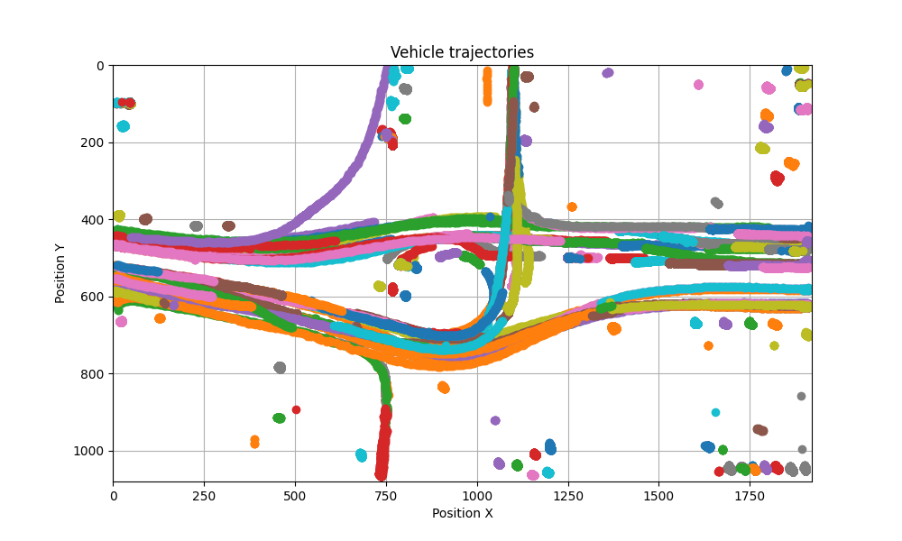
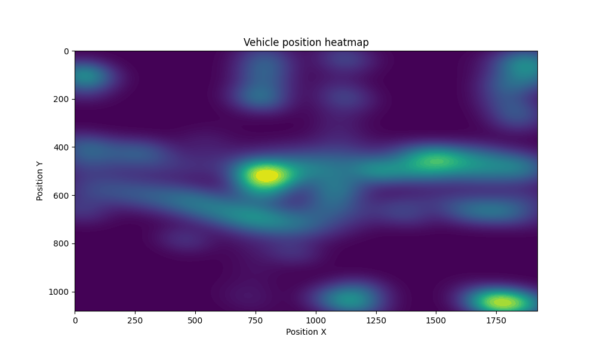

# Vehicle Tracking and Heatmap Visualization

## Description

This project implements a vehicle tracking system using computer vision techniques with the YOLO (You Only Look Once) model for object detection. The system processes video frames to track vehicles, generates their trajectories, and creates heatmap visualizations to represent areas of high vehicle density.

## Features

- Real-time vehicle detection and tracking.
- Visualization of vehicle trajectories.
- Generation of heatmaps to show areas of high vehicle density.
- Support for saving processed videos with visual annotations.

## Video Processing
<div style="display: flex; justify-content: space-between;">   </div>

## Trajectory Visualization
<div style="display: flex; justify-content: space-between;">   </div>

## Getting Started

1. Clone the repository:
   ```bash
   git clone https://github.com/yourusername/vehicle-tracking.git
   cd vehicle-tracking

2. Install the required packages:

    ```bash
    pip install -r requirements.txt

3. Download the pre-trained YOLO weights and place them in the project directory. You can find them in another GitHub project:
https://github.com/roboflow/supervision

4. Prepare your input video and place it in the data/in/ directory. You can also modify the input video path in the command line arguments.

5. Run the video processing script:
    ```bash
    python main.py --video_in data/in/video.mov --video_out data/out/video_complete.mp4 --model_path traffic_analysis.pt

6. If you want to visualize the trajectories from a CSV file without reprocessing the video, provide the path to the CSV file:
    ```bash
    python main.py --csv_file data/out/trajectories.csv